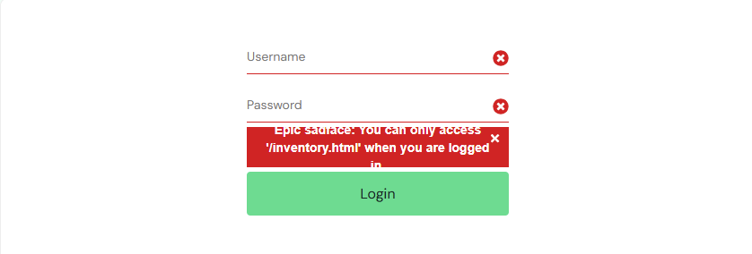

# Bug Report 02 – Unexpected Logout on Back Navigation

## Description
User is unexpectedly logged out when navigating back from the cart page using the browser back button.

This interrupts the session without any explicit logout action.

## Preconditions
- User is logged in
- User is on inventory page

## Steps to Reproduce
1. Go to https://www.saucedemo.com/
2. Login with valid credentials:
   - Username: standard_user
   - Password: secret_sauce
3. Add a product to the cart
4. Navigate to the cart page
5. Click browser "Back" button

## Expected Result
- User remains logged in
- Previous page (inventory) is displayed correctly

## Actual Result
- User is logged out
- Error message displayed:
  "You can only access '/inventory.html' when you are logged in"

## Severity
Medium

## Priority
Medium

## Notes
- This may indicate a session handling issue
- Navigation using browser controls should not invalidate the session
- Cart contents persisted after re-login

## Screenshot

